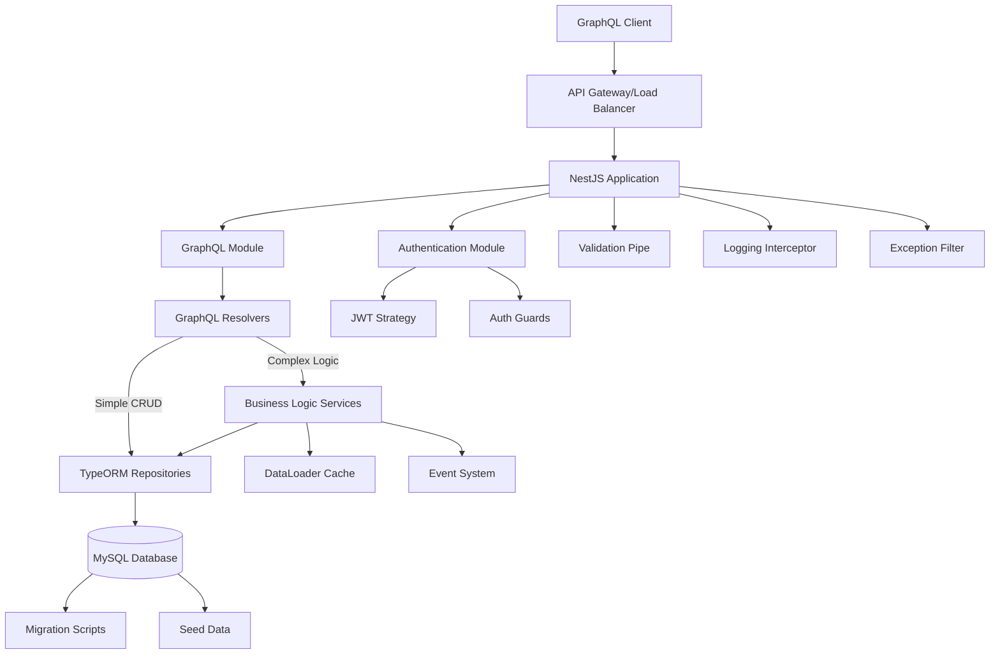
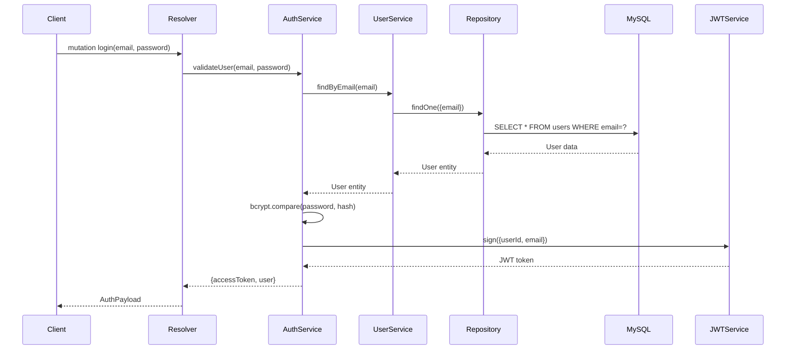
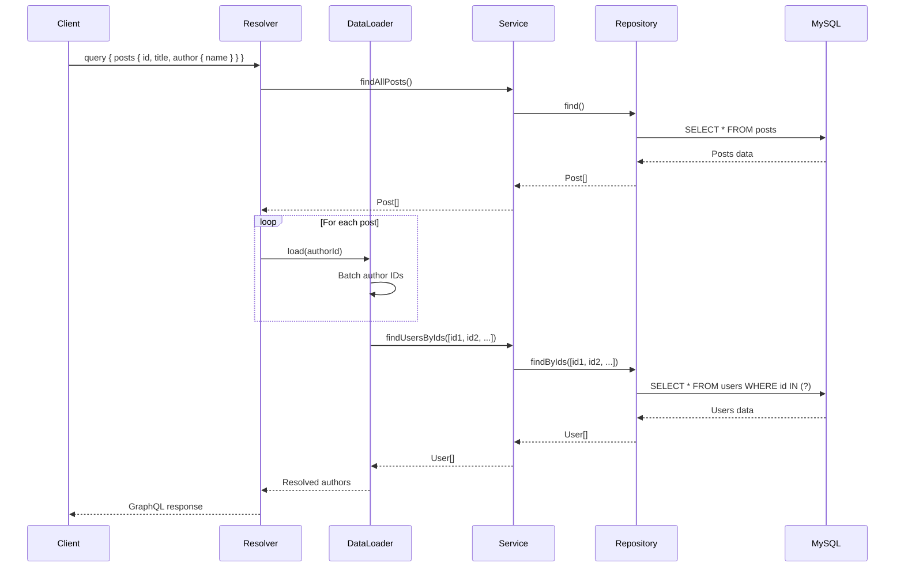
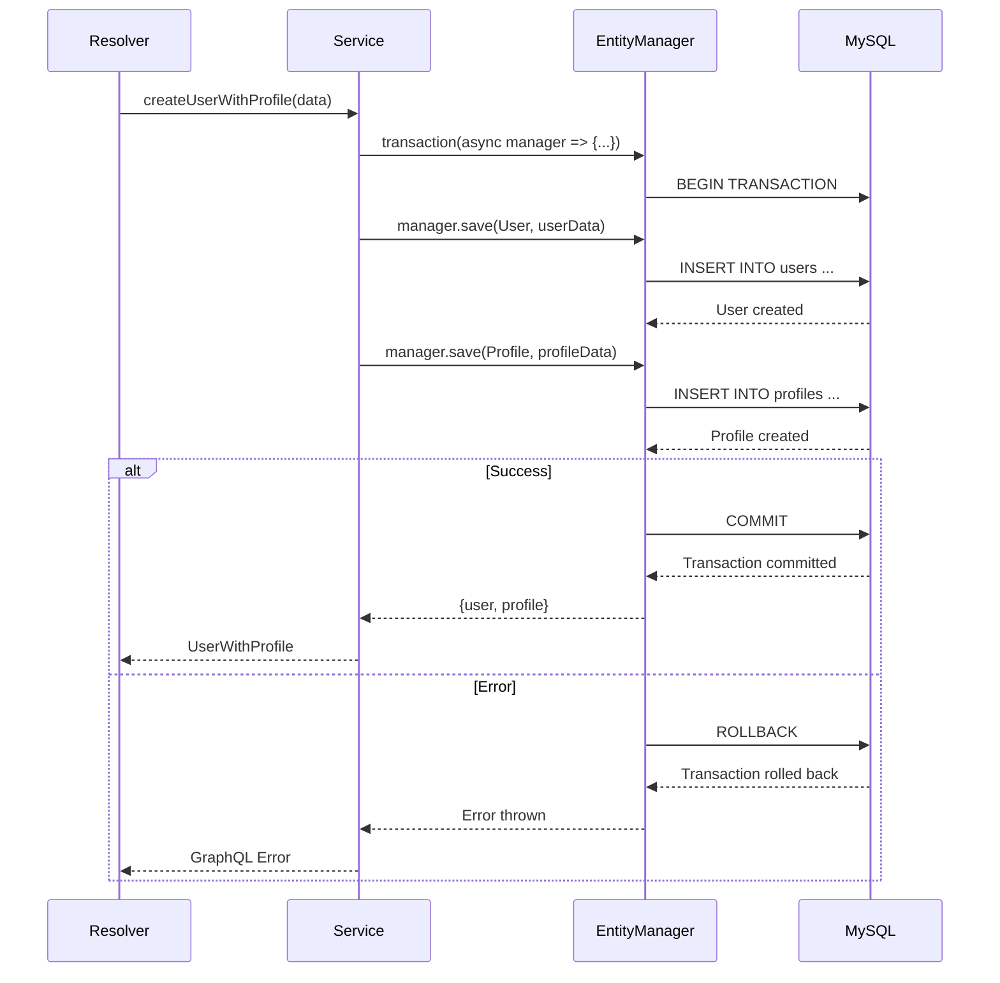

# Design Document: NestJS GraphQL API with TypeORM and MySQL

## References

This design follows official NestJS documentation and best practices:

- **NestJS Official Documentation**: [https://docs.nestjs.com](https://docs.nestjs.com)
- **NestJS GraphQL Quick Start**: [https://docs.nestjs.com/graphql/quick-start](https://docs.nestjs.com/graphql/quick-start)
- **NestJS TypeORM Integration**: [https://docs.nestjs.com/techniques/database](https://docs.nestjs.com/techniques/database)
- **NestJS Authentication**: [https://docs.nestjs.com/security/authentication](https://docs.nestjs.com/security/authentication)

## Overview

This design specifies a production-ready NestJS GraphQL API with TypeORM integration and MySQL database support. The system provides a scalable, type-safe GraphQL interface with robust data persistence, comprehensive error handling, authentication/authorization, request validation, logging, and monitoring capabilities. The architecture follows NestJS best practices with modular design, dependency injection, and separation of concerns. It includes entity management, repository patterns, GraphQL resolvers with field-level resolution, DataLoader for N+1 query optimization, database migrations, connection pooling, transaction management, and comprehensive testing strategies.

The API is designed for enterprise-grade applications requiring high performance, maintainability, and scalability. It leverages TypeScript's type system throughout the stack, from GraphQL schema definitions to database entities, ensuring end-to-end type safety. The design incorporates industry-standard patterns including CQRS principles, DTOs for data transfer, guards for authentication, interceptors for logging and transformation, and pipes for validation.

**GraphQL Approach**: This design uses the **code-first** approach as recommended by NestJS, where TypeScript decorators and classes automatically generate the GraphQL schema. This provides better type safety and reduces duplication between TypeScript types and GraphQL schema definitions.

## Architecture

### Architectural Principles

**Resolver-Service Pattern**:

This design follows a pragmatic approach to the resolver-service pattern:

1. **Simple CRUD Operations**: Implemented directly in GraphQL resolvers using repository methods

   - Single entity create/update/delete operations
   - No business logic beyond basic validation
   - No side effects or external calls
   - Example: Creating a tag, updating a post title

2. **Complex Business Logic**: Delegated to service layer
   - Operations involving multiple entities
   - Database transactions
   - Password hashing, encryption, or security operations
   - External API calls or integrations
   - Event emission or notifications
   - Complex validation or business rules
   - Example: User registration with email verification, creating post with tags and notifications

**Benefits**:

- Reduces unnecessary abstraction for simple operations
- Keeps complex logic testable and maintainable in services
- Improves code readability by avoiding over-engineering
- Follows NestJS best practices for layered architecture

**Layer Responsibilities**:

- **Resolvers**: GraphQL request/response handling, simple CRUD, field resolution
- **Services**: Complex business logic, orchestration, transactions
- **Repositories**: Direct database access via TypeORM
- **Guards**: Authentication and authorization
- **Pipes**: Input validation and transformation
- **Interceptors**: Logging, caching, response transformation

### System Architecture Diagram



## Sequence Diagrams

### User Authentication Flow



### GraphQL Query with DataLoader



### Database Transaction Flow



## Project Structure

This section defines the complete folder structure for the NestJS GraphQL API following modular architecture and separation of concerns.

### Root Directory Structure

```
nestjs-graphql-api/
├── src/
│   ├── common/              # Shared utilities, decorators, guards, interceptors
│   ├── config/              # Configuration files
│   ├── database/            # Database-related files
│   ├── modules/             # Feature modules
│   ├── app.module.ts        # Root application module
│   └── main.ts              # Application entry point
├── test/                    # E2E tests
├── dist/                    # Compiled output
├── node_modules/            # Dependencies
├── .env.development         # Development environment variables
├── .env.production          # Production environment variables
├── .eslintrc.js             # ESLint configuration
├── .prettierrc              # Prettier configuration
├── .gitignore               # Git ignore rules
├── docker-compose.yml       # Docker compose for local development
├── Dockerfile               # Production Docker image
├── nest-cli.json            # Nest CLI configuration
├── package.json             # Project dependencies
├── tsconfig.json            # TypeScript configuration
├── tsconfig.build.json      # TypeScript build configuration
└── README.md                # Project documentation
```

### Detailed Source Structure

```
src/
├── common/
│   ├── decorators/
│   │   ├── current-user.decorator.ts      # Extract current user from context
│   │   ├── roles.decorator.ts             # Role-based access control decorator
│   │   └── public.decorator.ts            # Mark routes as public (skip auth)
│   ├── guards/
│   │   ├── jwt-auth.guard.ts              # JWT authentication guard
│   │   ├── roles.guard.ts                 # Role authorization guard
│   │   └── gql-auth.guard.ts              # GraphQL-specific auth guard
│   ├── interceptors/
│   │   ├── logging.interceptor.ts         # Request/response logging
│   │   ├── transform.interceptor.ts       # Response transformation
│   │   └── timeout.interceptor.ts         # Request timeout handling
│   ├── filters/
│   │   ├── all-exceptions.filter.ts       # Global exception handler
│   │   ├── graphql-exception.filter.ts    # GraphQL-specific errors
│   │   └── validation-exception.filter.ts # Validation error formatting
│   ├── pipes/
│   │   ├── validation.pipe.ts             # Input validation pipe
│   │   └── parse-uuid.pipe.ts             # UUID parsing and validation
│   ├── interfaces/
│   │   ├── graphql-context.interface.ts   # GraphQL context type
│   │   ├── jwt-payload.interface.ts       # JWT token payload
│   │   └── paginated-response.interface.ts # Pagination response type
│   ├── dto/
│   │   ├── pagination.input.ts            # Pagination input DTO
│   │   └── pagination-response.dto.ts     # Pagination response DTO
│   └── utils/
│       ├── slug.util.ts                   # Slug generation utility
│       ├── password.util.ts               # Password hashing utility
│       └── date.util.ts                   # Date formatting utilities
│
├── config/
│   ├── app.config.ts                      # Application configuration
│   ├── database.config.ts                 # Database configuration
│   ├── graphql.config.ts                  # GraphQL configuration
│   ├── jwt.config.ts                      # JWT configuration
│   ├── development.config.ts              # Development environment config
│   ├── production.config.ts               # Production environment config
│   └── env.validation.ts                  # Environment variable validation schema
│
├── database/
│   ├── migrations/
│   │   ├── 1234567890123-CreateUsersTable.ts
│   │   ├── 1234567890124-CreatePostsTable.ts
│   │   ├── 1234567890125-CreateCommentsTable.ts
│   │   ├── 1234567890126-CreateProfilesTable.ts
│   │   └── 1234567890127-CreateTagsTable.ts
│   ├── seeds/
│   │   ├── user.seed.ts                   # Seed users
│   │   ├── post.seed.ts                   # Seed posts
│   │   └── tag.seed.ts                    # Seed tags
│   └── data-source.ts                     # TypeORM data source configuration
│
├── modules/
│   ├── auth/
│   │   ├── dto/
│   │   │   ├── login.input.ts             # Login input DTO
│   │   │   ├── register.input.ts          # Registration input DTO
│   │   │   └── auth-payload.dto.ts        # Auth response DTO
│   │   ├── strategies/
│   │   │   ├── jwt.strategy.ts            # JWT Passport strategy
│   │   │   └── jwt-refresh.strategy.ts    # JWT refresh token strategy
│   │   ├── auth.module.ts                 # Auth module definition
│   │   ├── auth.service.ts                # Auth business logic
│   │   ├── auth.resolver.ts               # Auth GraphQL resolver
│   │   └── auth.service.spec.ts           # Auth service unit tests
│   │
│   ├── user/
│   │   ├── dto/
│   │   │   ├── create-user.input.ts       # Create user input DTO
│   │   │   ├── update-user.input.ts       # Update user input DTO
│   │   │   └── user-filters.input.ts      # User filtering input
│   │   ├── entities/
│   │   │   └── user.entity.ts             # User TypeORM entity
│   │   ├── loaders/
│   │   │   └── user.loader.ts             # DataLoader for users
│   │   ├── user.module.ts                 # User module definition
│   │   ├── user.service.ts                # User complex business logic
│   │   ├── user.resolver.ts               # User GraphQL resolver
│   │   ├── user.service.spec.ts           # User service unit tests
│   │   └── user.resolver.spec.ts          # User resolver unit tests
│   │
│   ├── post/
│   │   ├── dto/
│   │   │   ├── create-post.input.ts       # Create post input DTO
│   │   │   ├── update-post.input.ts       # Update post input DTO
│   │   │   └── post-filters.input.ts      # Post filtering input
│   │   ├── entities/
│   │   │   └── post.entity.ts             # Post TypeORM entity
│   │   ├── enums/
│   │   │   └── post-status.enum.ts        # Post status enum
│   │   ├── loaders/
│   │   │   └── post.loader.ts             # DataLoader for posts
│   │   ├── post.module.ts                 # Post module definition
│   │   ├── post.service.ts                # Post complex business logic
│   │   ├── post.resolver.ts               # Post GraphQL resolver
│   │   ├── post.service.spec.ts           # Post service unit tests
│   │   └── post.resolver.spec.ts          # Post resolver unit tests
│   │
│   ├── comment/
│   │   ├── dto/
│   │   │   ├── create-comment.input.ts    # Create comment input DTO
│   │   │   └── update-comment.input.ts    # Update comment input DTO
│   │   ├── entities/
│   │   │   └── comment.entity.ts          # Comment TypeORM entity
│   │   ├── loaders/
│   │   │   └── comment.loader.ts          # DataLoader for comments
│   │   ├── comment.module.ts              # Comment module definition
│   │   ├── comment.service.ts             # Comment complex business logic
│   │   ├── comment.resolver.ts            # Comment GraphQL resolver
│   │   ├── comment.service.spec.ts        # Comment service unit tests
│   │   └── comment.resolver.spec.ts       # Comment resolver unit tests
│   │
│   ├── profile/
│   │   ├── dto/
│   │   │   ├── create-profile.input.ts    # Create profile input DTO
│   │   │   └── update-profile.input.ts    # Update profile input DTO
│   │   ├── entities/
│   │   │   └── profile.entity.ts          # Profile TypeORM entity
│   │   ├── profile.module.ts              # Profile module definition
│   │   ├── profile.resolver.ts            # Profile GraphQL resolver (simple CRUD)
│   │   ├── profile.service.ts             # Profile complex business logic (if needed)
│   │   └── profile.resolver.spec.ts       # Profile resolver unit tests
│   │
│   ├── tag/
│   │   ├── dto/
│   │   │   ├── create-tag.input.ts        # Create tag input DTO
│   │   │   └── update-tag.input.ts        # Update tag input DTO
│   │   ├── entities/
│   │   │   └── tag.entity.ts              # Tag TypeORM entity
│   │   ├── tag.module.ts                  # Tag module definition
│   │   ├── tag.resolver.ts                # Tag GraphQL resolver (simple CRUD)
│   │   └── tag.resolver.spec.ts           # Tag resolver unit tests
│   │
│   └── health/
│       ├── health.module.ts               # Health check module
│       └── health.controller.ts           # Health check REST endpoint
│
├── app.module.ts                          # Root application module
└── main.ts                                # Application bootstrap
```

### Test Directory Structure

```
test/
├── e2e/
│   ├── auth.e2e-spec.ts                   # Auth end-to-end tests
│   ├── user.e2e-spec.ts                   # User end-to-end tests
│   ├── post.e2e-spec.ts                   # Post end-to-end tests
│   └── comment.e2e-spec.ts                # Comment end-to-end tests
├── fixtures/
│   ├── user.fixture.ts                    # Test user data
│   ├── post.fixture.ts                    # Test post data
│   └── comment.fixture.ts                 # Test comment data
├── helpers/
│   ├── test-db.helper.ts                  # Database test utilities
│   └── graphql-request.helper.ts          # GraphQL request helpers
└── jest-e2e.json                          # Jest E2E configuration
```

### Module Structure Pattern

Each feature module follows this consistent structure:

```
module-name/
├── dto/                    # Data Transfer Objects (Input/Output types)
│   ├── create-*.input.ts   # Creation input
│   ├── update-*.input.ts   # Update input
│   └── *-filters.input.ts  # Filtering/search input
├── entities/               # TypeORM entities
│   └── *.entity.ts         # Database entity with GraphQL decorators
├── enums/                  # Enumerations (if needed)
│   └── *.enum.ts           # Enum definitions
├── loaders/                # DataLoader implementations (if needed)
│   └── *.loader.ts         # Batch loading functions
├── *.module.ts             # NestJS module definition
├── *.service.ts            # Complex business logic (optional)
├── *.resolver.ts           # GraphQL resolver
├── *.service.spec.ts       # Service unit tests (if service exists)
└── *.resolver.spec.ts      # Resolver unit tests
```

### Key Files Description

**main.ts** - Application entry point:

```typescript
import { NestFactory } from '@nestjs/core';
import { AppModule } from './app.module';
import { ValidationPipe } from '@nestjs/common';

async function bootstrap() {
  const app = await NestFactory.create(AppModule);

  // Global pipes, filters, interceptors
  app.useGlobalPipes(new ValidationPipe());

  await app.listen(3000);
}
bootstrap();
```

**app.module.ts** - Root module:

```typescript
import { Module } from '@nestjs/common';
import { ConfigModule } from '@nestjs/config';
import { GraphQLModule } from '@nestjs/graphql';
import { TypeOrmModule } from '@nestjs/typeorm';
import { AuthModule } from './modules/auth/auth.module';
import { UserModule } from './modules/user/user.module';
import { PostModule } from './modules/post/post.module';
// ... other imports

@Module({
  imports: [
    ConfigModule.forRoot(),
    TypeOrmModule.forRoot(),
    GraphQLModule.forRoot(),
    AuthModule,
    UserModule,
    PostModule,
    // ... other modules
  ],
})
export class AppModule {}
```

### Naming Conventions

**Files:**

- Entities: `*.entity.ts` (e.g., `user.entity.ts`)
- DTOs: `*.input.ts` or `*.dto.ts` (e.g., `create-user.input.ts`)
- Modules: `*.module.ts` (e.g., `user.module.ts`)
- Services: `*.service.ts` (e.g., `user.service.ts`)
- Resolvers: `*.resolver.ts` (e.g., `user.resolver.ts`)
- Guards: `*.guard.ts` (e.g., `jwt-auth.guard.ts`)
- Interceptors: `*.interceptor.ts` (e.g., `logging.interceptor.ts`)
- Filters: `*.filter.ts` (e.g., `all-exceptions.filter.ts`)
- Pipes: `*.pipe.ts` (e.g., `validation.pipe.ts`)
- Tests: `*.spec.ts` (unit) or `*.e2e-spec.ts` (e2e)

**Classes:**

- PascalCase for class names (e.g., `UserService`, `CreateUserInput`)
- Suffix with type (e.g., `UserEntity`, `JwtAuthGuard`)

**Variables/Functions:**

- camelCase (e.g., `findUserById`, `currentUser`)

### Configuration Files

**.env.development**:

```bash
NODE_ENV=development
PORT=3000
DB_HOST=localhost
DB_PORT=3306
DB_USERNAME=root
DB_PASSWORD=password
DB_DATABASE=nestjs_graphql_dev
JWT_SECRET=dev-secret-key
```

**.env.production**:

```bash
NODE_ENV=production
PORT=3000
DB_HOST=${DB_HOST}
DB_PORT=${DB_PORT}
DB_USERNAME=${DB_USERNAME}
DB_PASSWORD=${DB_PASSWORD}
DB_DATABASE=${DB_DATABASE}
JWT_SECRET=${JWT_SECRET}
```

**nest-cli.json**:

```json
{
  "collection": "@nestjs/schematics",
  "sourceRoot": "src",
  "compilerOptions": {
    "deleteOutDir": true,
    "assets": ["**/*.graphql"],
    "watchAssets": true
  }
}
```

**tsconfig.json**:

```json
{
  "compilerOptions": {
    "module": "commonjs",
    "declaration": true,
    "removeComments": true,
    "emitDecoratorMetadata": true,
    "experimentalDecorators": true,
    "allowSyntheticDefaultImports": true,
    "target": "ES2021",
    "sourceMap": true,
    "outDir": "./dist",
    "baseUrl": "./",
    "incremental": true,
    "skipLibCheck": true,
    "strictNullChecks": false,
    "noImplicitAny": false,
    "strictBindCallApply": false,
    "forceConsistentCasingInFileNames": false,
    "noFallthroughCasesInSwitch": false,
    "paths": {
      "@common/*": ["src/common/*"],
      "@config/*": ["src/config/*"],
      "@modules/*": ["src/modules/*"]
    }
  }
}
```

### Benefits of This Structure

1. **Modularity**: Each feature is self-contained in its own module
2. **Scalability**: Easy to add new features without affecting existing code
3. **Maintainability**: Clear separation of concerns and consistent patterns
4. **Testability**: Each component can be tested in isolation
5. **Discoverability**: Developers can easily find related files
6. **Consistency**: All modules follow the same structure pattern
7. **Separation**: Common utilities are shared, feature code is isolated

## Components and Interfaces

### Component 1: GraphQL Module

**Purpose**: Configures GraphQL server with Apollo, schema generation, and playground

**Interface**:

```typescript
interface GraphQLModuleConfig {
  autoSchemaFile: string | boolean;
  sortSchema: boolean;
  playground: boolean;
  debug: boolean;
  context: (ctx: any) => Promise<GraphQLContext>;
  formatError: (error: GraphQLError) => any;
  installSubscriptionHandlers?: boolean;
}

interface GraphQLContext {
  req: Request;
  res: Response;
  user?: JWTPayload;
  loaders: DataLoaderRegistry;
}
```

**Responsibilities**:

- Initialize Apollo Server with NestJS
- Generate GraphQL schema from TypeScript decorators
- Provide request context with authentication and DataLoaders
- Configure error formatting and debugging
- Enable GraphQL Playground for development

### Component 2: Authentication Module

**Purpose**: Handles user authentication, JWT token generation/validation, and authorization

**Interface**:

```typescript
interface AuthService {
  validateUser(email: string, password: string): Promise<User | null>;
  login(user: User): Promise<AuthPayload>;
  register(input: RegisterInput): Promise<AuthPayload>;
  verifyToken(token: string): Promise<JWTPayload>;
  refreshToken(refreshToken: string): Promise<AuthPayload>;
}

interface JWTPayload {
  sub: string; // user ID
  email: string;
  roles: string[];
  iat: number;
  exp: number;
}

interface AuthPayload {
  accessToken: string;
  refreshToken: string;
  user: User;
  expiresIn: number;
}
```

**Responsibilities**:

- Validate user credentials with bcrypt password hashing
- Generate JWT access and refresh tokens
- Implement JWT strategy for Passport
- Provide authentication guards for resolvers
- Handle token refresh and expiration

### Component 3: User Module

**Purpose**: Manages user entities, business logic, and GraphQL resolvers

**Architecture Pattern**:

- **Simple CRUD mutations**: Implemented directly in resolvers using repository methods
- **Complex business logic**: Delegated to service layer for operations involving multiple entities, transactions, or business rules

**Interface**:

```typescript
// Service handles complex business logic only
interface UserService {
  // Complex: involves password hashing, validation, potential email verification
  registerUser(input: RegisterUserInput): Promise<User>;

  // Complex: involves multiple entities (user + profile) in transaction
  createUserWithProfile(userData: CreateUserInput, profileData: CreateProfileInput): Promise<UserWithProfile>;

  // Complex: batch loading for DataLoader
  findByIds(ids: string[]): Promise<User[]>;

  // Complex: involves pagination, filtering, sorting
  findAll(pagination: PaginationInput, filters?: UserFilters): Promise<PaginatedUsers>;

  // Complex: may involve cascading updates, notifications
  deactivateUser(id: string, reason: string): Promise<User>;
}

interface UserResolver {
  // Queries
  @Query(() => User)
  user(@Args('id') id: string): Promise<User>; // Simple: direct repository.findOne()

  @Query(() => PaginatedUsers)
  users(@Args('pagination') pagination: PaginationInput): Promise<PaginatedUsers>; // Complex: uses service

  @Query(() => User)
  me(@Context() context: GraphQLContext): Promise<User>; // Simple: direct repository.findOne()

  // Simple CRUD Mutations (direct repository access)
  @Mutation(() => User)
  createUser(@Args('input') input: CreateUserInput): Promise<User>; // Simple: direct repository.save()

  @Mutation(() => User)
  updateUser(@Args('id') id: string, @Args('input') input: UpdateUserInput): Promise<User>; // Simple: direct repository.update()

  @Mutation(() => Boolean)
  deleteUser(@Args('id') id: string): Promise<boolean>; // Simple: direct repository.delete()

  // Complex Mutations (use service)
  @Mutation(() => AuthPayload)
  register(@Args('input') input: RegisterUserInput): Promise<AuthPayload>; // Complex: uses service

  @Mutation(() => UserWithProfile)
  createUserWithProfile(@Args('userData') userData: CreateUserInput, @Args('profileData') profileData: CreateProfileInput): Promise<UserWithProfile>; // Complex: uses service
}
```

**Implementation Examples**:

```typescript
// Simple CRUD - Direct in Resolver
@Resolver(() => User)
export class UserResolver {
  constructor(
    @InjectRepository(User)
    private readonly userRepository: Repository<User>,
  ) {}

  @Mutation(() => User)
  async createUser(@Args('input') input: CreateUserInput): Promise<User> {
    // Simple CRUD: create and save directly
    const user = this.userRepository.create(input);
    return this.userRepository.save(user);
  }

  @Mutation(() => User)
  async updateUser(
    @Args('id') id: string,
    @Args('input') input: UpdateUserInput,
  ): Promise<User> {
    // Simple CRUD: update directly
    await this.userRepository.update(id, input);
    return this.userRepository.findOne({ where: { id } });
  }

  @Mutation(() => Boolean)
  async deleteUser(@Args('id') id: string): Promise<boolean> {
    // Simple CRUD: delete directly
    const result = await this.userRepository.delete(id);
    return result.affected > 0;
  }
}

// Complex Logic - Use Service
@Resolver(() => User)
export class UserResolver {
  constructor(
    @InjectRepository(User)
    private readonly userRepository: Repository<User>,
    private readonly userService: UserService, // Inject service for complex operations
  ) {}

  @Mutation(() => AuthPayload)
  async register(
    @Args('input') input: RegisterUserInput,
  ): Promise<AuthPayload> {
    // Complex: password hashing, validation, token generation
    return this.userService.registerUser(input);
  }

  @Mutation(() => UserWithProfile)
  async createUserWithProfile(
    @Args('userData') userData: CreateUserInput,
    @Args('profileData') profileData: CreateProfileInput,
  ): Promise<UserWithProfile> {
    // Complex: transaction with multiple entities
    return this.userService.createUserWithProfile(userData, profileData);
  }

  @Query(() => PaginatedUsers)
  async users(
    @Args('pagination') pagination: PaginationInput,
  ): Promise<PaginatedUsers> {
    // Complex: pagination, filtering, sorting logic
    return this.userService.findAll(pagination);
  }
}
```

**Decision Criteria**:

Use **Service** when mutation involves:

- Multiple database operations in a transaction
- Password hashing or encryption
- External API calls
- Complex validation or business rules
- Multiple entities coordination
- Event emission or side effects
- Caching logic
- Email/notification sending

Use **Direct Repository** when mutation is:

- Single entity CRUD operation
- No business logic beyond validation
- No side effects or external calls
- Simple create/update/delete

**Responsibilities**:

- Resolvers: Handle GraphQL request/response, simple CRUD operations, field resolution
- Services: Complex business logic, transactions, multi-entity operations
- Repositories: Direct database access
- Input validation: Handled by ValidationPipe before reaching resolver
- DataLoader integration: For batch loading in field resolvers

### Component 4: TypeORM Module

**Purpose**: Configures database connection, entity management, and migrations

**Interface**:

```typescript
interface TypeORMConfig {
  type: 'mysql';
  host: string;
  port: number;
  username: string;
  password: string;
  database: string;
  entities: string[];
  migrations: string[];
  synchronize: boolean;
  logging: boolean | string[];
  poolSize: number;
  connectTimeout: number;
  acquireTimeout: number;
  charset: string;
  timezone: string;
}

interface Repository<T> {
  find(options?: FindManyOptions<T>): Promise<T[]>;
  findOne(options: FindOneOptions<T>): Promise<T | null>;
  findByIds(ids: any[]): Promise<T[]>;
  save(entity: T | T[]): Promise<T | T[]>;
  update(criteria: any, partialEntity: any): Promise<UpdateResult>;
  delete(criteria: any): Promise<DeleteResult>;
  count(options?: FindManyOptions<T>): Promise<number>;
  createQueryBuilder(alias: string): SelectQueryBuilder<T>;
}
```

**Responsibilities**:

- Establish MySQL database connection with pooling
- Register entities and repositories
- Execute migrations and seed data
- Provide transaction management
- Handle connection errors and retries

### Component 5: DataLoader Module

**Purpose**: Implements DataLoader pattern for N+1 query optimization

**Interface**:

```typescript
interface DataLoaderRegistry {
  userLoader: DataLoader<string, User>;
  postLoader: DataLoader<string, Post>;
  commentLoader: DataLoader<string, Comment>;
}

interface DataLoaderFactory {
  createUserLoader(): DataLoader<string, User>;
  createPostLoader(): DataLoader<string, Post>;
  createCommentLoader(): DataLoader<string, Comment>;
}
```

**Responsibilities**:

- Batch and cache database queries per request
- Prevent N+1 query problems in GraphQL
- Create loader instances per request context
- Implement custom batch loading functions
- Clear cache after mutations

### Component 6: Validation Module

**Purpose**: Validates input data using class-validator and custom validators

**Interface**:

```typescript
interface ValidationPipe {
  transform(value: any, metadata: ArgumentMetadata): Promise<any>;
  validateInput(input: any, type: Type<any>): Promise<ValidationError[]>;
}

interface CustomValidator {
  validate(value: any, args: ValidationArguments): boolean | Promise<boolean>;
  defaultMessage(args: ValidationArguments): string;
}
```

**Responsibilities**:

- Validate GraphQL input types
- Transform and sanitize input data
- Provide custom validation decorators
- Generate user-friendly error messages
- Integrate with class-validator library

## Data Models

### Model 1: User Entity

```typescript
@ObjectType()
@Entity('users')
export class User {
  @Field(() => ID)
  @PrimaryGeneratedColumn('uuid')
  id: string;

  @Field()
  @Column({ unique: true, length: 255 })
  @Index()
  email: string;

  @Column({ length: 255 })
  passwordHash: string;

  @Field()
  @Column({ length: 100 })
  firstName: string;

  @Field()
  @Column({ length: 100 })
  lastName: string;

  @Field(() => [String])
  @Column('simple-array', { default: 'user' })
  roles: string[];

  @Field()
  @Column({ default: true })
  isActive: boolean;

  @Field(() => Date)
  @CreateDateColumn()
  createdAt: Date;

  @Field(() => Date)
  @UpdateDateColumn()
  updatedAt: Date;

  @Field(() => [Post])
  @OneToMany(() => Post, (post) => post.author)
  posts: Post[];

  @Field(() => Profile, { nullable: true })
  @OneToOne(() => Profile, (profile) => profile.user, { cascade: true })
  profile?: Profile;
}
```

**Validation Rules**:

- email: Must be valid email format, unique, max 255 characters
- passwordHash: Minimum 8 characters before hashing, must contain uppercase, lowercase, number
- firstName: Required, 1-100 characters, alphanumeric with spaces
- lastName: Required, 1-100 characters, alphanumeric with spaces
- roles: Array of valid role strings (user, admin, moderator)
- isActive: Boolean, defaults to true

### Model 2: Post Entity

```typescript
@ObjectType()
@Entity('posts')
export class Post {
  @Field(() => ID)
  @PrimaryGeneratedColumn('uuid')
  id: string;

  @Field()
  @Column({ length: 255 })
  title: string;

  @Field()
  @Column('text')
  content: string;

  @Field()
  @Column({ length: 255, unique: true })
  @Index()
  slug: string;

  @Field(() => PostStatus)
  @Column({
    type: 'enum',
    enum: PostStatus,
    default: PostStatus.DRAFT,
  })
  status: PostStatus;

  @Field()
  @Column({ default: 0 })
  viewCount: number;

  @Field(() => Date, { nullable: true })
  @Column({ type: 'timestamp', nullable: true })
  publishedAt?: Date;

  @Field(() => Date)
  @CreateDateColumn()
  createdAt: Date;

  @Field(() => Date)
  @UpdateDateColumn()
  updatedAt: Date;

  @Field(() => User)
  @ManyToOne(() => User, (user) => user.posts, { onDelete: 'CASCADE' })
  @JoinColumn({ name: 'authorId' })
  author: User;

  @Column('uuid')
  @Index()
  authorId: string;

  @Field(() => [Comment])
  @OneToMany(() => Comment, (comment) => comment.post)
  comments: Comment[];

  @Field(() => [Tag])
  @ManyToMany(() => Tag, (tag) => tag.posts)
  @JoinTable({ name: 'post_tags' })
  tags: Tag[];
}

enum PostStatus {
  DRAFT = 'DRAFT',
  PUBLISHED = 'PUBLISHED',
  ARCHIVED = 'ARCHIVED',
}
```

**Validation Rules**:

- title: Required, 1-255 characters, non-empty after trim
- content: Required, minimum 10 characters, maximum 50000 characters
- slug: Required, unique, lowercase, alphanumeric with hyphens, 1-255 characters
- status: Must be valid PostStatus enum value
- viewCount: Non-negative integer
- publishedAt: Valid date, cannot be in the future
- authorId: Valid UUID, must reference existing user

### Model 3: Comment Entity

```typescript
@ObjectType()
@Entity('comments')
export class Comment {
  @Field(() => ID)
  @PrimaryGeneratedColumn('uuid')
  id: string;

  @Field()
  @Column('text')
  content: string;

  @Field()
  @Column({ default: false })
  isEdited: boolean;

  @Field(() => Date)
  @CreateDateColumn()
  createdAt: Date;

  @Field(() => Date)
  @UpdateDateColumn()
  updatedAt: Date;

  @Field(() => User)
  @ManyToOne(() => User, { onDelete: 'CASCADE' })
  @JoinColumn({ name: 'authorId' })
  author: User;

  @Column('uuid')
  @Index()
  authorId: string;

  @Field(() => Post)
  @ManyToOne(() => Post, (post) => post.comments, { onDelete: 'CASCADE' })
  @JoinColumn({ name: 'postId' })
  post: Post;

  @Column('uuid')
  @Index()
  postId: string;

  @Field(() => Comment, { nullable: true })
  @ManyToOne(() => Comment, (comment) => comment.replies, {
    nullable: true,
    onDelete: 'CASCADE',
  })
  @JoinColumn({ name: 'parentId' })
  parent?: Comment;

  @Column('uuid', { nullable: true })
  @Index()
  parentId?: string;

  @Field(() => [Comment])
  @OneToMany(() => Comment, (comment) => comment.parent)
  replies: Comment[];
}
```

**Validation Rules**:

- content: Required, 1-5000 characters, non-empty after trim
- isEdited: Boolean, automatically set to true on update
- authorId: Valid UUID, must reference existing user
- postId: Valid UUID, must reference existing post
- parentId: Optional, valid UUID, must reference existing comment, cannot create circular references

### Model 4: Profile Entity

```typescript
@ObjectType()
@Entity('profiles')
export class Profile {
  @Field(() => ID)
  @PrimaryGeneratedColumn('uuid')
  id: string;

  @Field({ nullable: true })
  @Column('text', { nullable: true })
  bio?: string;

  @Field({ nullable: true })
  @Column({ length: 255, nullable: true })
  avatarUrl?: string;

  @Field({ nullable: true })
  @Column({ length: 255, nullable: true })
  website?: string;

  @Field({ nullable: true })
  @Column({ length: 100, nullable: true })
  location?: string;

  @Field(() => Date, { nullable: true })
  @Column({ type: 'date', nullable: true })
  birthDate?: Date;

  @Field(() => Date)
  @CreateDateColumn()
  createdAt: Date;

  @Field(() => Date)
  @UpdateDateColumn()
  updatedAt: Date;

  @Field(() => User)
  @OneToOne(() => User, (user) => user.profile, { onDelete: 'CASCADE' })
  @JoinColumn({ name: 'userId' })
  user: User;

  @Column('uuid', { unique: true })
  @Index()
  userId: string;
}
```

**Validation Rules**:

- bio: Optional, maximum 1000 characters
- avatarUrl: Optional, valid URL format, HTTPS only, maximum 255 characters
- website: Optional, valid URL format, maximum 255 characters
- location: Optional, 1-100 characters
- birthDate: Optional, valid date, must be in the past, user must be at least 13 years old
- userId: Valid UUID, must reference existing user, unique

### Model 5: Tag Entity

```typescript
@ObjectType()
@Entity('tags')
export class Tag {
  @Field(() => ID)
  @PrimaryGeneratedColumn('uuid')
  id: string;

  @Field()
  @Column({ length: 50, unique: true })
  @Index()
  name: string;

  @Field()
  @Column({ length: 50, unique: true })
  @Index()
  slug: string;

  @Field({ nullable: true })
  @Column('text', { nullable: true })
  description?: string;

  @Field(() => Date)
  @CreateDateColumn()
  createdAt: Date;

  @Field(() => [Post])
  @ManyToMany(() => Tag, (post) => post.tags)
  posts: Post[];
}
```

**Validation Rules**:

- name: Required, unique, 1-50 characters, alphanumeric with spaces
- slug: Required, unique, lowercase, alphanumeric with hyphens, 1-50 characters
- description: Optional, maximum 500 characters

## Algorithmic Pseudocode

### Main Application Bootstrap Algorithm

```typescript
async function bootstrap(): Promise<void> {
  // Preconditions:
  // - Environment variables are loaded and validated
  // - Database connection configuration is available
  // - All required modules are properly imported

  const app = await NestFactory.create(AppModule, {
    logger: ['error', 'warn', 'log', 'debug', 'verbose'],
  });

  // Configure global pipes for validation
  app.useGlobalPipes(
    new ValidationPipe({
      whitelist: true,
      forbidNonWhitelisted: true,
      transform: true,
      transformOptions: {
        enableImplicitConversion: true,
      },
    }),
  );

  // Configure global filters for exception handling
  app.useGlobalFilters(new AllExceptionsFilter());

  // Configure global interceptors for logging and transformation
  app.useGlobalInterceptors(
    new LoggingInterceptor(),
    new TransformInterceptor(),
  );

  // Enable CORS with security configurations
  app.enableCors({
    origin: process.env.ALLOWED_ORIGINS?.split(',') || '*',
    credentials: true,
    methods: ['GET', 'POST', 'PUT', 'DELETE', 'OPTIONS'],
    allowedHeaders: ['Content-Type', 'Authorization'],
  });

  // Configure security headers
  app.use(helmet());

  // Configure rate limiting
  app.use(
    rateLimit({
      windowMs: 15 * 60 * 1000, // 15 minutes
      max: 100, // limit each IP to 100 requests per windowMs
    }),
  );

  const port = process.env.PORT || 3000;
  await app.listen(port);

  // Postconditions:
  // - Application is listening on specified port
  // - All middleware and interceptors are registered
  // - Database connection is established
  // - GraphQL playground is accessible (in development)

  console.log(`Application is running on: http://localhost:${port}/graphql`);
}
```

**Preconditions:**

- Environment variables (DATABASE_URL, JWT_SECRET, PORT) are set and valid
- Node.js runtime version >= 16.x
- MySQL server is running and accessible
- All npm dependencies are installed

**Postconditions:**

- NestJS application is running and listening on configured port
- GraphQL endpoint is accessible at /graphql
- Database connection pool is established
- All global pipes, filters, and interceptors are active
- CORS and security middleware are configured

**Loop Invariants:** N/A (no loops in bootstrap)

### User Authentication Algorithm

```typescript
async function authenticateUser(
  email: string,
  password: string,
): Promise<AuthPayload> {
  // Preconditions:
  // - email is non-empty valid email format
  // - password is non-empty string
  // - Database connection is active

  // Step 1: Find user by email
  const user = await userRepository.findOne({
    where: { email: email.toLowerCase() },
    select: ['id', 'email', 'passwordHash', 'roles', 'isActive'],
  });

  // Step 2: Validate user exists and is active
  if (!user) {
    throw new UnauthorizedException('Invalid credentials');
  }

  if (!user.isActive) {
    throw new UnauthorizedException('Account is deactivated');
  }

  // Step 3: Verify password
  const isPasswordValid = await bcrypt.compare(password, user.passwordHash);

  if (!isPasswordValid) {
    throw new UnauthorizedException('Invalid credentials');
  }

  // Step 4: Generate JWT tokens
  const payload: JWTPayload = {
    sub: user.id,
    email: user.email,
    roles: user.roles,
    iat: Math.floor(Date.now() / 1000),
    exp: Math.floor(Date.now() / 1000) + 3600, // 1 hour
  };

  const accessToken = jwtService.sign(payload);
  const refreshToken = jwtService.sign({ sub: user.id }, { expiresIn: '7d' });

  // Step 5: Return authentication payload
  return {
    accessToken,
    refreshToken,
    user,
    expiresIn: 3600,
  };

  // Postconditions:
  // - Valid JWT access token is generated
  // - Valid JWT refresh token is generated
  // - User object is returned without password hash
  // - Tokens are signed with secret key
}
```

**Preconditions:**

- email parameter is non-empty and valid email format
- password parameter is non-empty string (minimum 8 characters)
- Database connection is established and active
- User repository is properly initialized
- JWT service is configured with valid secret

**Postconditions:**

- Returns AuthPayload with valid access and refresh tokens
- Access token expires in 1 hour
- Refresh token expires in 7 days
- User object does not contain password hash
- Throws UnauthorizedException if credentials are invalid or user is inactive

**Loop Invariants:** N/A (no loops in authentication)

### DataLoader Batch Loading Algorithm

```typescript
async function batchLoadUsers(userIds: string[]): Promise<User[]> {
  // Preconditions:
  // - userIds is non-empty array of valid UUIDs
  // - No duplicate IDs in the array
  // - Database connection is active

  // Step 1: Query database for all users in batch
  const users = await userRepository.findByIds(userIds);

  // Step 2: Create a map for O(1) lookup
  const userMap = new Map<string, User>();
  for (const user of users) {
    userMap.set(user.id, user);
  }

  // Step 3: Return users in same order as input IDs
  // Return null for IDs that don't exist
  const result: User[] = [];
  for (const id of userIds) {
    const user = userMap.get(id);
    result.push(user || null);
  }

  // Postconditions:
  // - Result array has same length as input userIds
  // - Users are in same order as requested IDs
  // - Missing users are represented as null
  // - Single database query executed (no N+1)

  return result;
}
```

**Preconditions:**

- userIds is array of valid UUID strings
- userIds array is non-empty
- Database connection is active
- User repository is initialized

**Postconditions:**

- Returns array of User objects or null values
- Result array length equals input userIds length
- Users are ordered to match input ID order
- Only one database query is executed regardless of array size
- Missing users are represented as null in result array

**Loop Invariants:**

- For map creation loop: All processed users are correctly stored in userMap
- For result building loop: Result array maintains order correspondence with userIds

### GraphQL Query Resolution with Pagination Algorithm

```typescript
async function findPaginatedPosts(
  pagination: PaginationInput,
): Promise<PaginatedPosts> {
  // Preconditions:
  // - pagination.page >= 1
  // - pagination.limit > 0 and <= 100
  // - Database connection is active

  const {
    page = 1,
    limit = 10,
    sortBy = 'createdAt',
    sortOrder = 'DESC',
  } = pagination;

  // Step 1: Calculate offset
  const offset = (page - 1) * limit;

  // Step 2: Build query with sorting and pagination
  const queryBuilder = postRepository
    .createQueryBuilder('post')
    .leftJoinAndSelect('post.author', 'author')
    .skip(offset)
    .take(limit)
    .orderBy(`post.${sortBy}`, sortOrder);

  // Step 3: Execute query and count total
  const [posts, total] = await queryBuilder.getManyAndCount();

  // Step 4: Calculate pagination metadata
  const totalPages = Math.ceil(total / limit);
  const hasNextPage = page < totalPages;
  const hasPreviousPage = page > 1;

  // Step 5: Return paginated result
  return {
    items: posts,
    pageInfo: {
      currentPage: page,
      pageSize: limit,
      totalItems: total,
      totalPages,
      hasNextPage,
      hasPreviousPage,
    },
  };

  // Postconditions:
  // - Returns posts for requested page
  // - items.length <= limit
  // - Pagination metadata is accurate
  // - Posts are sorted by specified field and order
}
```

**Preconditions:**

- pagination.page is positive integer >= 1
- pagination.limit is positive integer > 0 and <= 100
- pagination.sortBy is valid Post entity field name
- pagination.sortOrder is either 'ASC' or 'DESC'
- Database connection is active

**Postconditions:**

- Returns PaginatedPosts object with items and pageInfo
- items array length is <= pagination.limit
- pageInfo.totalItems reflects actual database count
- pageInfo.totalPages is correctly calculated
- hasNextPage and hasPreviousPage flags are accurate
- Posts are sorted according to sortBy and sortOrder parameters

**Loop Invariants:** N/A (no explicit loops, database handles iteration)

### Database Transaction Management Algorithm

```typescript
async function createUserWithProfile(
  userData: CreateUserInput,
  profileData: CreateProfileInput,
): Promise<UserWithProfile> {
  // Preconditions:
  // - userData is validated and contains required fields
  // - profileData is validated
  // - userData.email is unique in database
  // - Database connection is active

  return await dataSource.transaction(async (manager) => {
    // Step 1: Hash password
    const passwordHash = await bcrypt.hash(userData.password, 10);

    // Step 2: Create user entity
    const user = manager.create(User, {
      email: userData.email.toLowerCase(),
      passwordHash,
      firstName: userData.firstName,
      lastName: userData.lastName,
      roles: ['user'],
    });

    // Step 3: Save user to database
    const savedUser = await manager.save(User, user);

    // Step 4: Create profile entity linked to user
    const profile = manager.create(Profile, {
      ...profileData,
      userId: savedUser.id,
    });

    // Step 5: Save profile to database
    const savedProfile = await manager.save(Profile, profile);

    // Step 6: Return combined result
    return {
      user: savedUser,
      profile: savedProfile,
    };

    // Postconditions:
    // - User is created in database with hashed password
    // - Profile is created and linked to user
    // - Transaction is committed if all operations succeed
    // - Transaction is rolled back if any operation fails
    // - No partial data is persisted on failure
  });
}
```

**Preconditions:**

- userData contains valid email, password, firstName, lastName
- userData.email is unique (not already in database)
- userData.password meets complexity requirements (min 8 chars, uppercase, lowercase, number)
- profileData is validated (optional fields are properly formatted)
- Database connection is active and transaction support is available

**Postconditions:**

- User entity is persisted with hashed password
- Profile entity is persisted and linked to user via userId
- Both operations succeed atomically (all or nothing)
- On success: transaction is committed, both records exist in database
- On failure: transaction is rolled back, no records are persisted
- Returns UserWithProfile object containing both entities

**Loop Invariants:** N/A (no loops in transaction)

### Migration Execution Algorithm

```typescript
async function runMigrations(): Promise<void> {
  // Preconditions:
  // - Database connection is established
  // - Migration files exist in configured directory
  // - migrations table exists or can be created

  const dataSource = await getDataSource();

  // Step 1: Get pending migrations
  const pendingMigrations = await dataSource.showMigrations();

  if (!pendingMigrations) {
    console.log('No pending migrations');
    return;
  }

  // Step 2: Execute migrations in order
  console.log('Running pending migrations...');
  await dataSource.runMigrations({
    transaction: 'all', // Run all migrations in single transaction
  });

  // Step 3: Verify migrations were applied
  const remainingMigrations = await dataSource.showMigrations();

  if (remainingMigrations) {
    throw new Error('Some migrations failed to apply');
  }

  console.log('All migrations completed successfully');

  // Postconditions:
  // - All pending migrations are executed
  // - Database schema is up to date
  // - migrations table is updated with executed migrations
  // - All migrations executed in single transaction
}
```

**Preconditions:**

- Database connection is established and valid
- Migration files are present in configured migrations directory
- migrations table exists in database (or TypeORM can create it)
- Database user has sufficient privileges to alter schema

**Postconditions:**

- All pending migrations are executed successfully
- Database schema matches latest migration state
- migrations table contains records of all executed migrations
- If any migration fails, all changes are rolled back (transaction: 'all')
- No pending migrations remain after successful execution

**Loop Invariants:**

- For migration execution: All previously executed migrations remain valid
- Database schema remains consistent throughout migration process

## Key Functions with Formal Specifications

### Function 1: createPost()

```typescript
async function createPost(
  input: CreatePostInput,
  userId: string,
): Promise<Post>;
```

**Preconditions:**

- input.title is non-empty string, 1-255 characters
- input.content is non-empty string, minimum 10 characters
- input.slug is unique, lowercase, alphanumeric with hyphens
- userId is valid UUID of existing active user
- User has permission to create posts
- Database connection is active

**Postconditions:**

- Returns newly created Post entity with generated UUID
- Post.authorId equals userId parameter
- Post.status is set to DRAFT by default
- Post.createdAt and updatedAt are set to current timestamp
- Post.viewCount is initialized to 0
- Post is persisted in database
- If tags are provided, post_tags junction table is updated

**Loop Invariants:**

- For tag association loop: All processed tags are valid and linked to post

### Function 2: updatePost()

```typescript
async function updatePost(
  postId: string,
  input: UpdatePostInput,
  userId: string,
): Promise<Post>;
```

**Preconditions:**

- postId is valid UUID of existing post
- userId is valid UUID of existing user
- User is either post author or has admin role
- input contains at least one field to update
- If slug is updated, new slug is unique
- Database connection is active

**Postconditions:**

- Returns updated Post entity
- Post.updatedAt is set to current timestamp
- Only provided fields in input are modified
- Post.id and Post.createdAt remain unchanged
- If status changes to PUBLISHED, publishedAt is set to current timestamp
- Database record is updated atomically

**Loop Invariants:** N/A

### Function 3: deletePost()

```typescript
async function deletePost(postId: string, userId: string): Promise<boolean>;
```

**Preconditions:**

- postId is valid UUID of existing post
- userId is valid UUID of existing user
- User is either post author or has admin role
- Database connection is active

**Postconditions:**

- Returns true if deletion successful
- Post record is removed from database
- Related comments are cascade deleted (onDelete: CASCADE)
- Related post_tags junction records are removed
- Post author's posts array no longer includes deleted post
- Throws NotFoundException if post doesn't exist
- Throws ForbiddenException if user lacks permission

**Loop Invariants:** N/A

### Function 4: validateJWT()

```typescript
async function validateJWT(token: string): Promise<JWTPayload>;
```

**Preconditions:**

- token is non-empty string
- token follows JWT format (header.payload.signature)
- JWT_SECRET environment variable is set
- Token is not expired

**Postconditions:**

- Returns decoded JWTPayload if token is valid
- Payload contains sub (user ID), email, roles, iat, exp
- Throws UnauthorizedException if token is invalid
- Throws UnauthorizedException if token is expired
- Throws UnauthorizedException if signature verification fails

**Loop Invariants:** N/A

### Function 5: hashPassword()

```typescript
async function hashPassword(password: string): Promise<string>;
```

**Preconditions:**

- password is non-empty string
- password meets complexity requirements (min 8 chars, uppercase, lowercase, number)
- bcrypt library is available

**Postconditions:**

- Returns bcrypt hash string (60 characters)
- Hash uses salt rounds = 10
- Same password produces different hashes (due to random salt)
- Hash can be verified with bcrypt.compare()
- Original password cannot be recovered from hash

**Loop Invariants:** N/A

## Example Usage

### Example 1: User Registration and Authentication

```typescript
// GraphQL Mutation: Register new user
mutation RegisterUser {
  register(input: {
    email: "user@example.com"
    password: "SecurePass123"
    firstName: "John"
    lastName: "Doe"
  }) {
    accessToken
    refreshToken
    expiresIn
    user {
      id
      email
      firstName
      lastName
      roles
      createdAt
    }
  }
}

// GraphQL Mutation: Login existing user
mutation LoginUser {
  login(input: {
    email: "user@example.com"
    password: "SecurePass123"
  }) {
    accessToken
    refreshToken
    expiresIn
    user {
      id
      email
      firstName
      lastName
      roles
    }
  }
}

// Using the access token in subsequent requests
// HTTP Header: Authorization: Bearer <accessToken>
```

### Example 2: Creating and Querying Posts

```typescript
// GraphQL Mutation: Create new post (requires authentication)
mutation CreatePost {
  createPost(input: {
    title: "Getting Started with NestJS"
    content: "NestJS is a progressive Node.js framework..."
    slug: "getting-started-with-nestjs"
    tags: ["nestjs", "typescript", "backend"]
  }) {
    id
    title
    content
    slug
    status
    author {
      id
      firstName
      lastName
    }
    tags {
      id
      name
      slug
    }
    createdAt
  }
}

// GraphQL Query: Get paginated posts with authors
query GetPosts {
  posts(pagination: {
    page: 1
    limit: 10
    sortBy: "createdAt"
    sortOrder: DESC
  }) {
    items {
      id
      title
      slug
      status
      viewCount
      author {
        id
        firstName
        lastName
        email
      }
      tags {
        name
        slug
      }
      createdAt
    }
    pageInfo {
      currentPage
      pageSize
      totalItems
      totalPages
      hasNextPage
      hasPreviousPage
    }
  }
}

// GraphQL Query: Get single post with comments
query GetPost {
  post(id: "uuid-here") {
    id
    title
    content
    slug
    status
    viewCount
    publishedAt
    author {
      id
      firstName
      lastName
      profile {
        bio
        avatarUrl
      }
    }
    comments {
      id
      content
      createdAt
      author {
        firstName
        lastName
      }
      replies {
        id
        content
        author {
          firstName
          lastName
        }
      }
    }
    tags {
      name
      slug
    }
  }
}
```

### Example 3: User Profile Management

```typescript
// GraphQL Mutation: Update user profile
mutation UpdateProfile {
  updateProfile(input: {
    bio: "Full-stack developer passionate about TypeScript"
    avatarUrl: "https://example.com/avatar.jpg"
    website: "https://johndoe.dev"
    location: "San Francisco, CA"
  }) {
    id
    bio
    avatarUrl
    website
    location
    user {
      firstName
      lastName
      email
    }
  }
}

// GraphQL Query: Get current user with profile
query GetMe {
  me {
    id
    email
    firstName
    lastName
    roles
    profile {
      bio
      avatarUrl
      website
      location
      birthDate
    }
    posts {
      id
      title
      status
      createdAt
    }
  }
}
```

### Example 4: Comment Management with Nested Replies

```typescript
// GraphQL Mutation: Add comment to post
mutation AddComment {
  createComment(input: {
    postId: "post-uuid-here"
    content: "Great article! Very helpful."
  }) {
    id
    content
    createdAt
    author {
      firstName
      lastName
    }
    post {
      id
      title
    }
  }
}

// GraphQL Mutation: Reply to comment
mutation ReplyToComment {
  createComment(input: {
    postId: "post-uuid-here"
    content: "Thanks for the feedback!"
    parentId: "comment-uuid-here"
  }) {
    id
    content
    createdAt
    author {
      firstName
      lastName
    }
    parent {
      id
      content
      author {
        firstName
        lastName
      }
    }
  }
}
```

### Example 5: Advanced Filtering and Search

```typescript
// GraphQL Query: Search posts by title and filter by status
query SearchPosts {
  searchPosts(
    search: "NestJS"
    filters: {
      status: PUBLISHED
      authorId: "author-uuid-here"
      tags: ["typescript", "backend"]
    }
    pagination: {
      page: 1
      limit: 20
      sortBy: "publishedAt"
      sortOrder: DESC
    }
  ) {
    items {
      id
      title
      slug
      excerpt
      publishedAt
      viewCount
      author {
        firstName
        lastName
      }
      tags {
        name
      }
    }
    pageInfo {
      totalItems
      totalPages
      hasNextPage
    }
  }
}
```

### Example 6: Batch Operations with DataLoader

```typescript
// Resolver implementation showing DataLoader usage
@ResolveField(() => User)
async author(@Parent() post: Post, @Context() ctx: GraphQLContext): Promise<User> {
  // DataLoader batches all author requests in single query
  return ctx.loaders.userLoader.load(post.authorId);
}

// This prevents N+1 queries when fetching multiple posts
// Instead of: SELECT * FROM users WHERE id = ? (executed N times)
// DataLoader executes: SELECT * FROM users WHERE id IN (?, ?, ?, ...) (once)
```

### Example 7: Transaction Example in Service

```typescript
// Service method using transaction for atomic operations
async publishPostWithNotification(postId: string, userId: string): Promise<Post> {
  return await this.dataSource.transaction(async (manager) => {
    // Update post status
    const post = await manager.findOne(Post, { where: { id: postId } });

    if (!post) {
      throw new NotFoundException('Post not found');
    }

    if (post.authorId !== userId) {
      throw new ForbiddenException('Not authorized');
    }

    post.status = PostStatus.PUBLISHED;
    post.publishedAt = new Date();

    const updatedPost = await manager.save(Post, post);

    // Create notification (in same transaction)
    const notification = manager.create(Notification, {
      userId: post.authorId,
      type: 'POST_PUBLISHED',
      message: `Your post "${post.title}" has been published`,
      relatedId: post.id
    });

    await manager.save(Notification, notification);

    return updatedPost;
  });
}
```

## Correctness Properties

### Property 1: Authentication Token Validity

```typescript
// Universal quantification: For all valid authentication attempts
∀ (email: string, password: string) where user exists with matching credentials:
  authenticate(email, password) returns AuthPayload where:
    - accessToken is valid JWT signed with JWT_SECRET
    - accessToken.exp > current_time
    - accessToken.sub equals user.id
    - refreshToken is valid JWT with 7-day expiration
    - user object does not contain passwordHash field
```

### Property 2: Data Integrity in Transactions

```typescript
// Universal quantification: For all transaction operations
∀ (operation: TransactionOperation):
  IF operation completes successfully THEN:
    - All changes are committed atomically
    - Database state is consistent
  ELSE IF operation fails THEN:
    - All changes are rolled back
    - Database state is unchanged from before transaction
    - No partial data is persisted
```

### Property 3: Authorization Enforcement

```typescript
// Universal quantification: For all protected resolver operations
∀ (resolver: ProtectedResolver, user: User | null):
  IF user is null OR user.isActive is false THEN:
    - resolver throws UnauthorizedException
    - No data is returned
    - No database modifications occur
  ELSE IF user lacks required role THEN:
    - resolver throws ForbiddenException
```

### Property 4: DataLoader N+1 Prevention

```typescript
// Universal quantification: For all batch load operations
∀ (ids: string[], loader: DataLoader):
  loader.loadMany(ids) executes exactly 1 database query
  WHERE query uses IN clause with all ids
  AND result array length equals ids array length
  AND result order matches ids order
```

### Property 5: Input Validation

```typescript
// Universal quantification: For all GraphQL inputs
∀ (input: InputType, resolver: Resolver):
  IF input fails validation THEN:
    - resolver throws BadRequestException
    - Error message describes validation failure
    - No database operations are executed
  ELSE:
    - input is transformed according to DTOs
    - resolver proceeds with validated data
```

### Property 6: Password Security

```typescript
// Universal quantification: For all password operations
∀ (password: string):
  hashPassword(password) returns hash where:
    - hash length is 60 characters (bcrypt format)
    - hash includes salt (randomly generated)
    - Original password cannot be recovered from hash
    - bcrypt.compare(password, hash) returns true
    - Same password produces different hashes (different salts)
```

### Property 7: Pagination Consistency

```typescript
// Universal quantification: For all paginated queries
∀ (pagination: PaginationInput):
  findPaginated(pagination) returns result where:
    - result.items.length <= pagination.limit
    - result.pageInfo.totalItems equals actual database count
    - result.pageInfo.totalPages = ceil(totalItems / limit)
    - result.pageInfo.hasNextPage = (currentPage < totalPages)
    - result.pageInfo.hasPreviousPage = (currentPage > 1)
```

### Property 8: Cascade Deletion

```typescript
// Universal quantification: For all entity deletions with cascade
∀ (entity: Entity with cascade relations):
  delete(entity) results in:
    - entity is removed from database
    - All related entities with onDelete: CASCADE are removed
    - Junction table records are removed
    - No orphaned foreign key references remain
    - Operation is atomic (all or nothing)
```

## Error Handling

### Error Scenario 1: Invalid Authentication Credentials

**Condition**: User provides incorrect email or password during login
**Response**:

- Throw UnauthorizedException with message "Invalid credentials"
- Return HTTP 401 status code
- Do not reveal whether email or password was incorrect (security)
- Log failed attempt with IP address and timestamp
  **Recovery**:
- User can retry with correct credentials
- Implement rate limiting to prevent brute force attacks
- Lock account after 5 failed attempts within 15 minutes

### Error Scenario 2: Database Connection Failure

**Condition**: MySQL database is unreachable or connection pool is exhausted
**Response**:

- Throw ServiceUnavailableException with message "Database temporarily unavailable"
- Return HTTP 503 status code
- Log error with connection details (excluding credentials)
- Trigger health check failure
  **Recovery**:
- Implement automatic retry with exponential backoff (3 attempts)
- If retries fail, return error to client
- Monitor connection pool metrics
- Alert operations team if connection failures persist

### Error Scenario 3: Validation Failure

**Condition**: GraphQL input fails validation rules (e.g., invalid email format, missing required field)
**Response**:

- Throw BadRequestException with detailed validation errors
- Return HTTP 400 status code
- Include field-specific error messages in response
- Example: `{ "email": ["must be a valid email"], "password": ["must be at least 8 characters"] }`
  **Recovery**:
- Client corrects input based on error messages
- No server-side state change occurs
- Validation happens before any database operations

### Error Scenario 4: Unauthorized Resource Access

**Condition**: User attempts to modify/delete resource they don't own and lacks admin role
**Response**:

- Throw ForbiddenException with message "Insufficient permissions"
- Return HTTP 403 status code
- Log unauthorized access attempt with user ID and resource ID
- Do not reveal resource existence to unauthorized users
  **Recovery**:
- User must authenticate with proper credentials
- Admin can grant necessary permissions
- No data modification occurs

### Error Scenario 5: Resource Not Found

**Condition**: Requested entity (post, user, comment) does not exist in database
**Response**:

- Throw NotFoundException with message "Resource not found"
- Return HTTP 404 status code
- Include resource type in error message (e.g., "Post not found")
- Do not expose internal IDs or database structure
  **Recovery**:
- Client verifies resource ID is correct
- Client handles missing resource gracefully in UI
- No server-side action required

### Error Scenario 6: Duplicate Entry Violation

**Condition**: Attempt to create entity with unique constraint violation (e.g., duplicate email, slug)
**Response**:

- Throw ConflictException with message "Resource already exists"
- Return HTTP 409 status code
- Specify which field caused the conflict
- Example: "User with email 'user@example.com' already exists"
  **Recovery**:
- Client prompts user to use different value
- For slugs, auto-generate alternative (e.g., append number)
- Database transaction is rolled back

### Error Scenario 7: Transaction Rollback

**Condition**: Error occurs during multi-step transaction operation
**Response**:

- Catch error within transaction block
- Automatically rollback all changes
- Throw appropriate exception based on error type
- Log transaction failure with operation details
  **Recovery**:
- All database changes are reverted
- Client receives error response
- Client can retry entire operation
- Database remains in consistent state

### Error Scenario 8: GraphQL Syntax Error

**Condition**: Client sends malformed GraphQL query
**Response**:

- Apollo Server returns GraphQL error response
- HTTP 400 status code
- Error includes syntax error location and description
- Example: "Syntax Error: Expected Name, found }"
  **Recovery**:
- Client fixes GraphQL query syntax
- Server does not execute resolver
- No database operations occur

### Error Scenario 9: Rate Limit Exceeded

**Condition**: Client exceeds configured rate limit (100 requests per 15 minutes)
**Response**:

- Throw ThrottlerException with message "Too many requests"
- Return HTTP 429 status code
- Include Retry-After header with seconds until reset
- Log rate limit violation with IP address
  **Recovery**:
- Client waits for rate limit window to reset
- Client implements exponential backoff
- Consider increasing rate limit for authenticated users

### Error Scenario 10: JWT Token Expired

**Condition**: Access token has expired (after 1 hour)
**Response**:

- Throw UnauthorizedException with message "Token expired"
- Return HTTP 401 status code
- Include error code for client to distinguish from invalid token
  **Recovery**:
- Client uses refresh token to obtain new access token
- If refresh token also expired, user must re-authenticate
- Client automatically retries request with new token

## Testing Strategy

### Unit Testing Approach

**Framework**: Jest (included with NestJS)

**Coverage Goals**: Minimum 80% code coverage for services, resolvers, and utilities

**Key Test Categories**:

1. **Service Layer Tests**

   - Test each service method in isolation
   - Mock repository dependencies using Jest mocks
   - Test business logic without database
   - Example: UserService.create() validates input and calls repository.save()

2. **Resolver Tests**

   - Test GraphQL resolvers with mocked services
   - Verify correct service methods are called with correct parameters
   - Test authentication guard integration
   - Test field resolvers and DataLoader integration

3. **Repository Tests**

   - Test custom repository methods
   - Use in-memory SQLite database for fast tests
   - Verify query builders produce correct SQL
   - Test transaction handling

4. **Utility Function Tests**
   - Test password hashing and comparison
   - Test JWT token generation and validation
   - Test slug generation and sanitization
   - Test date/time utilities

**Example Unit Test**:

```typescript
describe('UserService', () => {
  let service: UserService;
  let repository: MockType<Repository<User>>;

  beforeEach(async () => {
    const module = await Test.createTestingModule({
      providers: [
        UserService,
        {
          provide: getRepositoryToken(User),
          useFactory: repositoryMockFactory,
        },
      ],
    }).compile();

    service = module.get(UserService);
    repository = module.get(getRepositoryToken(User));
  });

  describe('findById', () => {
    it('should return user when found', async () => {
      const user = { id: '1', email: 'test@example.com' };
      repository.findOne.mockResolvedValue(user);

      const result = await service.findById('1');

      expect(result).toEqual(user);
      expect(repository.findOne).toHaveBeenCalledWith({ where: { id: '1' } });
    });

    it('should throw NotFoundException when user not found', async () => {
      repository.findOne.mockResolvedValue(null);

      await expect(service.findById('999')).rejects.toThrow(NotFoundException);
    });
  });
});
```

### Property-Based Testing Approach

**Framework**: fast-check (TypeScript property-based testing library)

**Purpose**: Test properties that should hold for all valid inputs, not just specific examples

**Key Properties to Test**:

1. **Password Hashing Idempotency**

   - Property: For any valid password, hashing twice produces different hashes but both verify correctly
   - Generator: Arbitrary strings meeting password requirements

2. **Pagination Consistency**

   - Property: For any valid page/limit combination, returned items count <= limit and page info is consistent
   - Generator: Arbitrary positive integers for page and limit

3. **JWT Token Roundtrip**

   - Property: For any valid payload, sign(payload) then verify(token) returns original payload
   - Generator: Arbitrary objects with required JWT fields

4. **Slug Generation Uniqueness**

   - Property: For any title, generated slug is URL-safe and deterministic
   - Generator: Arbitrary strings with various characters

5. **DataLoader Batching**
   - Property: For any array of IDs, batch load returns results in same order
   - Generator: Arbitrary arrays of UUIDs

**Example Property-Based Test**:

```typescript
import * as fc from 'fast-check';

describe('Password Hashing Properties', () => {
  it('should produce different hashes for same password', async () => {
    await fc.assert(
      fc.asyncProperty(
        fc.string({ minLength: 8, maxLength: 100 }),
        async (password) => {
          const hash1 = await hashPassword(password);
          const hash2 = await hashPassword(password);

          // Hashes should be different (due to random salt)
          expect(hash1).not.toEqual(hash2);

          // But both should verify correctly
          expect(await bcrypt.compare(password, hash1)).toBe(true);
          expect(await bcrypt.compare(password, hash2)).toBe(true);
        },
      ),
      { numRuns: 100 },
    );
  });

  it('should maintain pagination invariants', async () => {
    await fc.assert(
      fc.asyncProperty(
        fc.integer({ min: 1, max: 100 }), // page
        fc.integer({ min: 1, max: 100 }), // limit
        async (page, limit) => {
          const result = await postService.findPaginated({ page, limit });

          // Items count should not exceed limit
          expect(result.items.length).toBeLessThanOrEqual(limit);

          // Page info should be consistent
          expect(result.pageInfo.currentPage).toBe(page);
          expect(result.pageInfo.pageSize).toBe(limit);
          expect(result.pageInfo.totalPages).toBe(
            Math.ceil(result.pageInfo.totalItems / limit),
          );
        },
      ),
      { numRuns: 50 },
    );
  });
});
```

### Integration Testing Approach

**Framework**: Jest with Supertest for HTTP testing

**Database**: Use Docker container with MySQL for integration tests (same as production)

**Setup**:

- Start MySQL container before tests
- Run migrations to create schema
- Seed test data
- Tear down after tests complete

**Key Integration Test Scenarios**:

1. **End-to-End Authentication Flow**

   - Register user → Login → Access protected endpoint with token
   - Verify JWT token works across requests
   - Test token expiration and refresh

2. **GraphQL Query with Relations**

   - Create user, posts, and comments
   - Query posts with nested author and comments
   - Verify DataLoader prevents N+1 queries (check query count)

3. **Transaction Rollback**

   - Start operation that creates multiple entities
   - Force error in middle of transaction
   - Verify no partial data is persisted

4. **Database Constraints**

   - Attempt to create duplicate email
   - Verify unique constraint is enforced
   - Verify foreign key constraints work

5. **Pagination Across Pages**
   - Create 50 posts
   - Query page 1, 2, 3 with limit 20
   - Verify no duplicates and all posts are returned

**Example Integration Test**:

```typescript
describe('Post API (e2e)', () => {
  let app: INestApplication;
  let authToken: string;

  beforeAll(async () => {
    const moduleFixture = await Test.createTestingModule({
      imports: [AppModule],
    }).compile();

    app = moduleFixture.createNestApplication();
    await app.init();

    // Register and login to get auth token
    const response = await request(app.getHttpServer())
      .post('/graphql')
      .send({
        query: `
          mutation {
            register(input: {
              email: "test@example.com"
              password: "Test123456"
              firstName: "Test"
              lastName: "User"
            }) {
              accessToken
            }
          }
        `,
      });

    authToken = response.body.data.register.accessToken;
  });

  it('should create post and retrieve with author', async () => {
    // Create post
    const createResponse = await request(app.getHttpServer())
      .post('/graphql')
      .set('Authorization', `Bearer ${authToken}`)
      .send({
        query: `
          mutation {
            createPost(input: {
              title: "Test Post"
              content: "This is test content"
              slug: "test-post"
            }) {
              id
              title
            }
          }
        `,
      });

    const postId = createResponse.body.data.createPost.id;

    // Query post with author
    const queryResponse = await request(app.getHttpServer())
      .post('/graphql')
      .send({
        query: `
          query {
            post(id: "${postId}") {
              id
              title
              content
              author {
                email
                firstName
                lastName
              }
            }
          }
        `,
      });

    expect(queryResponse.body.data.post).toMatchObject({
      id: postId,
      title: 'Test Post',
      content: 'This is test content',
      author: {
        email: 'test@example.com',
        firstName: 'Test',
        lastName: 'User',
      },
    });
  });

  afterAll(async () => {
    await app.close();
  });
});
```

## Performance Considerations

### Database Connection Pooling

**Configuration**:

- Pool size: 10 connections (adjust based on load)
- Connection timeout: 10 seconds
- Acquire timeout: 30 seconds
- Idle timeout: 10 minutes

**Rationale**: Connection pooling prevents overhead of creating new connections for each request. Pool size should be tuned based on concurrent request volume and database server capacity.

**Implementation**:

```typescript
TypeOrmModule.forRoot({
  type: 'mysql',
  poolSize: 10,
  connectTimeout: 10000,
  acquireTimeout: 30000,
  extra: {
    connectionLimit: 10,
    waitForConnections: true,
    queueLimit: 0,
  },
});
```

### DataLoader for N+1 Query Prevention

**Problem**: GraphQL field resolvers can cause N+1 queries when fetching related entities
**Solution**: Implement DataLoader to batch and cache database queries per request

**Example**: When fetching 100 posts with authors:

- Without DataLoader: 1 query for posts + 100 queries for authors = 101 queries
- With DataLoader: 1 query for posts + 1 batched query for authors = 2 queries

**Performance Impact**: Reduces database load by 50-99% for queries with relations

### Query Optimization

**Strategies**:

1. **Eager Loading**: Use `leftJoinAndSelect` for frequently accessed relations
2. **Lazy Loading**: Load relations on-demand for rarely accessed data
3. **Partial Selection**: Use `select` to fetch only required fields
4. **Indexing**: Add database indexes on frequently queried columns (email, slug, foreign keys)

**Example Optimized Query**:

```typescript
// Instead of loading all fields
const posts = await postRepository.find({ relations: ['author', 'comments'] });

// Load only required fields with indexed columns
const posts = await postRepository
  .createQueryBuilder('post')
  .select(['post.id', 'post.title', 'post.slug'])
  .leftJoin('post.author', 'author')
  .addSelect(['author.id', 'author.firstName', 'author.lastName'])
  .where('post.status = :status', { status: 'PUBLISHED' })
  .andWhere('post.publishedAt > :date', { date: thirtyDaysAgo })
  .getMany();
```

### Caching Strategy

**Redis Integration** (optional enhancement):

- Cache frequently accessed data (user profiles, popular posts)
- Cache duration: 5-15 minutes depending on data volatility
- Invalidate cache on mutations

**GraphQL Response Caching**:

- Use Apollo Server cache control directives
- Cache public queries (posts list, single post)
- Set appropriate max-age based on content freshness requirements

**Example**:

```typescript
@Query(() => Post)
@CacheControl({ maxAge: 300 }) // Cache for 5 minutes
async post(@Args('id') id: string): Promise<Post> {
  return this.postService.findById(id);
}
```

### Pagination Performance

**Implementation**: Use offset-based pagination with query limits
**Optimization**: Add composite indexes on sort columns + ID for efficient pagination

**Alternative for Large Datasets**: Cursor-based pagination

- More efficient for large offsets
- Prevents issues with data changes between page requests
- Use encoded cursor containing sort field + ID

### Database Indexing Strategy

**Required Indexes**:

```sql
-- Users table
CREATE INDEX idx_users_email ON users(email);
CREATE INDEX idx_users_created_at ON users(created_at);

-- Posts table
CREATE INDEX idx_posts_slug ON posts(slug);
CREATE INDEX idx_posts_author_id ON posts(author_id);
CREATE INDEX idx_posts_status ON posts(status);
CREATE INDEX idx_posts_published_at ON posts(published_at);
CREATE INDEX idx_posts_created_at ON posts(created_at);
CREATE FULLTEXT INDEX idx_posts_title_content ON posts(title, content);

-- Comments table
CREATE INDEX idx_comments_post_id ON comments(post_id);
CREATE INDEX idx_comments_author_id ON comments(author_id);
CREATE INDEX idx_comments_parent_id ON comments(parent_id);
CREATE INDEX idx_comments_created_at ON comments(created_at);

-- Profiles table
CREATE INDEX idx_profiles_user_id ON profiles(user_id);

-- Junction table
CREATE INDEX idx_post_tags_post_id ON post_tags(post_id);
CREATE INDEX idx_post_tags_tag_id ON post_tags(tag_id);
```

### Query Complexity Limits

**GraphQL Query Depth Limiting**:

- Maximum depth: 5 levels
- Prevents deeply nested queries that could cause performance issues

**Query Cost Analysis**:

- Assign cost to each field based on database complexity
- Reject queries exceeding cost threshold
- Protects against malicious or inefficient queries

**Implementation**:

```typescript
GraphQLModule.forRoot({
  validationRules: [depthLimit(5), createComplexityLimitRule(1000)],
});
```

### Monitoring and Profiling

**Metrics to Track**:

- GraphQL query execution time (p50, p95, p99)
- Database query count per request
- Database query execution time
- Connection pool utilization
- Memory usage
- CPU usage

**Tools**:

- Apollo Studio for GraphQL metrics
- TypeORM logging for slow queries
- Prometheus + Grafana for infrastructure metrics
- New Relic or DataDog for APM

## Security Considerations

### Authentication and Authorization

**JWT Token Security**:

- Use strong secret key (minimum 256 bits, randomly generated)
- Store secret in environment variables, never in code
- Set appropriate token expiration (1 hour for access, 7 days for refresh)
- Implement token rotation on refresh
- Use HTTPS only for token transmission

**Password Security**:

- Enforce strong password requirements (min 8 chars, uppercase, lowercase, number)
- Use bcrypt with salt rounds = 10 for hashing
- Never log or expose passwords in error messages
- Implement password reset with time-limited tokens
- Consider implementing password history to prevent reuse

**Role-Based Access Control (RBAC)**:

- Define roles: user, moderator, admin
- Implement guards to check roles before resolver execution
- Use decorators for declarative authorization
- Example: `@Roles('admin')` on admin-only resolvers

### Input Validation and Sanitization

**Validation Strategy**:

- Use class-validator decorators on all input DTOs
- Validate at GraphQL layer before business logic
- Whitelist allowed fields (forbidNonWhitelisted: true)
- Transform input to expected types

**SQL Injection Prevention**:

- TypeORM uses parameterized queries by default
- Never concatenate user input into raw SQL
- Use query builder or repository methods
- If raw queries needed, always use parameters

**XSS Prevention**:

- Sanitize user input before storing in database
- Use libraries like DOMPurify for HTML content
- Escape output when rendering (handled by GraphQL)
- Set Content-Security-Policy headers

### Rate Limiting and DDoS Protection

**Implementation**:

- Use @nestjs/throttler for rate limiting
- Limit: 100 requests per 15 minutes per IP
- Higher limits for authenticated users
- Implement exponential backoff for repeated violations

**GraphQL-Specific Protection**:

- Query depth limiting (max 5 levels)
- Query complexity analysis
- Disable introspection in production
- Implement query whitelisting for critical operations

### CORS Configuration

**Production Settings**:

```typescript
app.enableCors({
  origin: process.env.ALLOWED_ORIGINS.split(','), // Whitelist specific domains
  credentials: true,
  methods: ['GET', 'POST'],
  allowedHeaders: ['Content-Type', 'Authorization'],
  maxAge: 3600,
});
```

**Security Headers**:

```typescript
app.use(
  helmet({
    contentSecurityPolicy: {
      directives: {
        defaultSrc: ["'self'"],
        styleSrc: ["'self'", "'unsafe-inline'"],
        scriptSrc: ["'self'"],
        imgSrc: ["'self'", 'data:', 'https:'],
      },
    },
    hsts: {
      maxAge: 31536000,
      includeSubDomains: true,
      preload: true,
    },
  }),
);
```

### Data Privacy and Compliance

**Sensitive Data Handling**:

- Never expose password hashes in GraphQL responses
- Exclude sensitive fields from GraphQL object types
- Implement field-level authorization for private data
- Log access to sensitive resources for audit trail

**GDPR Compliance Considerations**:

- Implement user data export functionality
- Implement user data deletion (right to be forgotten)
- Store consent records for data processing
- Encrypt sensitive data at rest (consider database encryption)

### Database Security

**Connection Security**:

- Use SSL/TLS for database connections in production
- Store credentials in environment variables or secrets manager
- Use least-privilege database user (not root)
- Restrict database access to application servers only

**Backup and Recovery**:

- Implement automated daily backups
- Test backup restoration regularly
- Encrypt backups at rest and in transit
- Store backups in separate geographic location

### Logging and Monitoring

**Security Logging**:

- Log all authentication attempts (success and failure)
- Log authorization failures
- Log rate limit violations
- Log database errors and connection issues
- Never log sensitive data (passwords, tokens, PII)

**Audit Trail**:

- Track who created/modified/deleted resources
- Store IP addresses and user agents
- Implement log retention policy (90 days minimum)
- Use centralized logging service (ELK stack, CloudWatch)

### Dependency Security

**Best Practices**:

- Regularly update dependencies (npm audit, Dependabot)
- Review security advisories for critical packages
- Use npm audit fix to patch vulnerabilities
- Pin dependency versions in package-lock.json
- Scan Docker images for vulnerabilities

## Environment Configuration

This application supports two primary environments: **Development** and **Production**. Each environment has specific configurations optimized for its use case.

### Environment Variables

All environment-specific configurations are managed through environment variables. Use `.env` files for local development and secure secret management services (AWS Secrets Manager, HashiCorp Vault) for production.

**Required Environment Variables**:

```bash
# Application
NODE_ENV=development|production
PORT=3000

# Database
DB_TYPE=mysql
DB_HOST=localhost
DB_PORT=3306
DB_USERNAME=your_username
DB_PASSWORD=your_password
DB_DATABASE=nestjs_graphql_api
DB_SYNCHRONIZE=false
DB_LOGGING=false

# JWT Authentication
JWT_SECRET=your-super-secret-jwt-key-min-256-bits
JWT_EXPIRATION=3600
JWT_REFRESH_SECRET=your-refresh-token-secret
JWT_REFRESH_EXPIRATION=604800

# CORS
ALLOWED_ORIGINS=http://localhost:3000,http://localhost:4200

# Rate Limiting
RATE_LIMIT_TTL=900
RATE_LIMIT_MAX=100

# GraphQL
GRAPHQL_PLAYGROUND=true
GRAPHQL_DEBUG=true
GRAPHQL_INTROSPECTION=true

# Logging
LOG_LEVEL=debug

# Optional: Redis (for caching)
REDIS_HOST=localhost
REDIS_PORT=6379
REDIS_PASSWORD=
```

### Development Environment

**Purpose**: Local development, debugging, and testing

**Configuration**:

```typescript
// config/development.config.ts
export default {
  nodeEnv: 'development',
  port: 3000,

  database: {
    type: 'mysql',
    host: process.env.DB_HOST || 'localhost',
    port: parseInt(process.env.DB_PORT) || 3306,
    username: process.env.DB_USERNAME || 'root',
    password: process.env.DB_PASSWORD || 'password',
    database: process.env.DB_DATABASE || 'nestjs_graphql_dev',
    synchronize: false, // Use migrations even in dev
    logging: ['query', 'error', 'warn'],
    entities: ['src/**/*.entity.ts'],
    migrations: ['src/database/migrations/*.ts'],
    poolSize: 5,
  },

  graphql: {
    playground: true,
    debug: true,
    introspection: true,
    autoSchemaFile: 'schema.gql',
    sortSchema: true,
    context: ({ req, res }) => ({ req, res }),
  },

  jwt: {
    secret: process.env.JWT_SECRET || 'dev-secret-key-change-in-production',
    expiresIn: '1h',
    refreshSecret: process.env.JWT_REFRESH_SECRET || 'dev-refresh-secret',
    refreshExpiresIn: '7d',
  },

  cors: {
    origin: ['http://localhost:3000', 'http://localhost:4200'],
    credentials: true,
  },

  rateLimit: {
    ttl: 900, // 15 minutes
    limit: 1000, // Higher limit for development
  },

  logging: {
    level: 'debug',
    prettyPrint: true,
  },

  security: {
    helmet: false, // Disabled for easier debugging
    csrf: false,
  },
};
```

**Development Features**:

- GraphQL Playground enabled at `/graphql`
- Detailed query logging
- Hot module reloading with `npm run start:dev`
- Source maps enabled for debugging
- Verbose error messages with stack traces
- No rate limiting restrictions
- CORS allows localhost origins
- Database query logging enabled

**Development Setup**:

```bash
# Install dependencies
npm install

# Setup database
docker-compose up -d mysql

# Run migrations
npm run migration:run

# Seed database (optional)
npm run seed

# Start development server
npm run start:dev
```

### Production Environment

**Purpose**: Live production deployment serving real users

**Configuration**:

```typescript
// config/production.config.ts
export default {
  nodeEnv: 'production',
  port: parseInt(process.env.PORT) || 3000,

  database: {
    type: 'mysql',
    host: process.env.DB_HOST,
    port: parseInt(process.env.DB_PORT),
    username: process.env.DB_USERNAME,
    password: process.env.DB_PASSWORD,
    database: process.env.DB_DATABASE,
    synchronize: false, // NEVER true in production
    logging: ['error'],
    entities: ['dist/**/*.entity.js'],
    migrations: ['dist/database/migrations/*.js'],
    poolSize: 20,
    connectTimeout: 10000,
    acquireTimeout: 30000,
    ssl: {
      rejectUnauthorized: true,
    },
    extra: {
      connectionLimit: 20,
      waitForConnections: true,
      queueLimit: 0,
    },
  },

  graphql: {
    playground: false, // Disabled in production
    debug: false,
    introspection: false, // Disabled for security
    autoSchemaFile: true, // In-memory schema
    sortSchema: true,
    context: ({ req, res }) => ({ req, res }),
    formatError: (error) => {
      // Sanitize errors in production
      return {
        message: error.message,
        code: error.extensions?.code,
        // Don't expose stack traces
      };
    },
  },

  jwt: {
    secret: process.env.JWT_SECRET, // Must be set via secrets manager
    expiresIn: '1h',
    refreshSecret: process.env.JWT_REFRESH_SECRET,
    refreshExpiresIn: '7d',
  },

  cors: {
    origin: process.env.ALLOWED_ORIGINS?.split(',') || [],
    credentials: true,
    methods: ['GET', 'POST'],
    allowedHeaders: ['Content-Type', 'Authorization'],
  },

  rateLimit: {
    ttl: 900, // 15 minutes
    limit: 100, // Strict limit for production
  },

  logging: {
    level: 'info',
    prettyPrint: false,
    // Use JSON format for log aggregation
  },

  security: {
    helmet: true,
    csrf: true,
    hsts: {
      maxAge: 31536000,
      includeSubDomains: true,
      preload: true,
    },
  },
};
```

**Production Features**:

- GraphQL Playground disabled
- Introspection disabled for security
- Minimal error information exposed
- Strict rate limiting
- HTTPS/TLS required
- Database connection pooling optimized
- Helmet security headers enabled
- CORS restricted to whitelisted domains
- Structured JSON logging
- Error tracking integration (Sentry, etc.)
- Performance monitoring (APM)

**Production Deployment**:

```bash
# Build application
npm run build

# Run migrations (in deployment pipeline)
npm run migration:run

# Start production server
npm run start:prod
```

**Production Checklist**:

- [ ] All environment variables set via secrets manager
- [ ] Database uses SSL/TLS connections
- [ ] JWT secrets are strong random values (256+ bits)
- [ ] CORS origins are whitelisted (no wildcards)
- [ ] GraphQL playground and introspection disabled
- [ ] Rate limiting configured appropriately
- [ ] Helmet security headers enabled
- [ ] Database connection pooling configured
- [ ] Logging configured with appropriate level
- [ ] Error tracking service integrated
- [ ] Health check endpoints configured
- [ ] Database backups automated
- [ ] SSL certificates valid and auto-renewing
- [ ] Load balancer configured with health checks
- [ ] Monitoring and alerting configured

### Environment-Specific Module Configuration

**AppModule Configuration**:

```typescript
// app.module.ts
import { Module } from '@nestjs/common';
import { ConfigModule, ConfigService } from '@nestjs/config';
import { GraphQLModule } from '@nestjs/graphql';
import { ApolloDriver, ApolloDriverConfig } from '@nestjs/apollo';
import { TypeOrmModule } from '@nestjs/typeorm';
import developmentConfig from './config/development.config';
import productionConfig from './config/production.config';

const envConfig =
  process.env.NODE_ENV === 'production' ? productionConfig : developmentConfig;

@Module({
  imports: [
    ConfigModule.forRoot({
      isGlobal: true,
      load: [() => envConfig],
      envFilePath: `.env.${process.env.NODE_ENV || 'development'}`,
    }),

    TypeOrmModule.forRootAsync({
      inject: [ConfigService],
      useFactory: (config: ConfigService) => config.get('database'),
    }),

    GraphQLModule.forRootAsync<ApolloDriverConfig>({
      driver: ApolloDriver,
      inject: [ConfigService],
      useFactory: (config: ConfigService) => config.get('graphql'),
    }),

    // Other modules...
  ],
})
export class AppModule {}
```

### Docker Configuration

**Development Docker Compose**:

```yaml
# docker-compose.dev.yml
version: '3.8'

services:
  mysql:
    image: mysql:8.0
    environment:
      MYSQL_ROOT_PASSWORD: password
      MYSQL_DATABASE: nestjs_graphql_dev
    ports:
      - '3306:3306'
    volumes:
      - mysql_data:/var/lib/mysql

  redis:
    image: redis:7-alpine
    ports:
      - '6379:6379'

volumes:
  mysql_data:
```

**Production Docker Compose**:

```yaml
# docker-compose.prod.yml
version: '3.8'

services:
  app:
    build:
      context: .
      dockerfile: Dockerfile
    environment:
      NODE_ENV: production
    env_file:
      - .env.production
    ports:
      - '3000:3000'
    depends_on:
      - mysql
    restart: unless-stopped
    healthcheck:
      test: ['CMD', 'curl', '-f', 'http://localhost:3000/health']
      interval: 30s
      timeout: 10s
      retries: 3

  mysql:
    image: mysql:8.0
    environment:
      MYSQL_ROOT_PASSWORD: ${DB_PASSWORD}
      MYSQL_DATABASE: ${DB_DATABASE}
    volumes:
      - mysql_data:/var/lib/mysql
    restart: unless-stopped

  redis:
    image: redis:7-alpine
    restart: unless-stopped

volumes:
  mysql_data:
```

### Environment Validation

**Environment Variable Validation Schema**:

```typescript
// config/env.validation.ts
import * as Joi from 'joi';

export const envValidationSchema = Joi.object({
  NODE_ENV: Joi.string().valid('development', 'production', 'test').required(),
  PORT: Joi.number().default(3000),

  DB_HOST: Joi.string().required(),
  DB_PORT: Joi.number().default(3306),
  DB_USERNAME: Joi.string().required(),
  DB_PASSWORD: Joi.string().required(),
  DB_DATABASE: Joi.string().required(),

  JWT_SECRET: Joi.string().min(32).required(),
  JWT_EXPIRATION: Joi.number().default(3600),
  JWT_REFRESH_SECRET: Joi.string().min(32).required(),
  JWT_REFRESH_EXPIRATION: Joi.number().default(604800),

  ALLOWED_ORIGINS: Joi.string().required(),

  GRAPHQL_PLAYGROUND: Joi.boolean().default(false),
  GRAPHQL_DEBUG: Joi.boolean().default(false),
  GRAPHQL_INTROSPECTION: Joi.boolean().default(false),
});
```

## Dependencies

### Core Framework Dependencies

```json
{
  "@nestjs/common": "^10.0.0",
  "@nestjs/core": "^10.0.0",
  "@nestjs/platform-express": "^10.0.0",
  "@nestjs/graphql": "^12.0.0",
  "@nestjs/apollo": "^12.0.0",
  "apollo-server-express": "^3.12.0",
  "graphql": "^16.8.0"
}
```

### Database Dependencies

```json
{
  "@nestjs/typeorm": "^10.0.0",
  "typeorm": "^0.3.17",
  "mysql2": "^3.6.0"
}
```

### Authentication Dependencies

```json
{
  "@nestjs/jwt": "^10.1.0",
  "@nestjs/passport": "^10.0.0",
  "passport": "^0.6.0",
  "passport-jwt": "^4.0.1",
  "bcrypt": "^5.1.1",
  "@types/bcrypt": "^5.0.0"
}
```

### Validation Dependencies

```json
{
  "class-validator": "^0.14.0",
  "class-transformer": "^0.5.1"
}
```

### Utility Dependencies

```json
{
  "dataloader": "^2.2.2",
  "helmet": "^7.0.0",
  "express-rate-limit": "^6.10.0",
  "@nestjs/throttler": "^5.0.0"
}
```

### Development Dependencies

```json
{
  "@nestjs/testing": "^10.0.0",
  "@types/jest": "^29.5.0",
  "@types/node": "^20.0.0",
  "@types/supertest": "^2.0.12",
  "jest": "^29.5.0",
  "supertest": "^6.3.3",
  "ts-jest": "^29.1.0",
  "ts-node": "^10.9.1",
  "typescript": "^5.1.0",
  "fast-check": "^3.13.0"
}
```

### Optional Enhancement Dependencies

```json
{
  "@nestjs/config": "^3.0.0",
  "@nestjs/event-emitter": "^2.0.0",
  "ioredis": "^5.3.2",
  "@nestjs/cache-manager": "^2.1.0",
  "cache-manager-redis-store": "^3.0.1",
  "winston": "^3.10.0",
  "nest-winston": "^1.9.4"
}
```

### Environment Requirements

- Node.js: >= 16.x (LTS recommended)
- npm: >= 8.x
- MySQL: >= 8.0
- TypeScript: >= 5.0
- Docker: >= 20.x (for containerized deployment)

### External Services

- MySQL Database Server (required)
- Redis Cache Server (optional, for caching)
- Log Aggregation Service (optional, e.g., ELK, CloudWatch)
- APM Service (optional, e.g., New Relic, DataDog)
- Secret Management Service (recommended for production, e.g., AWS Secrets Manager, HashiCorp Vault)
